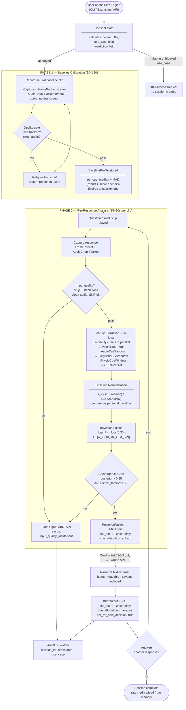
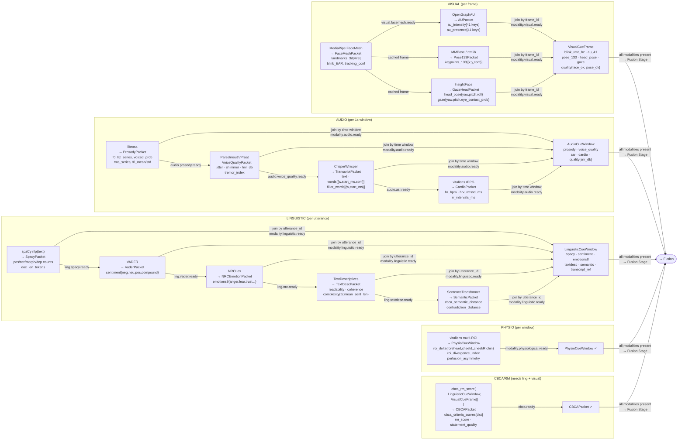

# Blitz Engine

> The open-source behavioral deception detection core.

Blitz Engine is a modular, research-driven engine that analyzes live webcam + mic input (plus text and WAV audio) to detect behavioral deception signals. The flagship app is the **Live Consensus Overlay**: 32 real-time cues across 4 voting families (visual · audio · linguistic · physio), fused with a Bayesian log-odds architecture, personal baseline calibration, and a two-gate consensus — plus an optional local-LLM **content engine** that judges the meaning of each Q&A answer and confirms it against the time-aligned cue activity.

**Not a lie detector. A behavioral signal analyzer.**

**▶ Run the Live Consensus Overlay:** see [docs/OVERLAY_README.md](docs/OVERLAY_README.md) — one command: `blitz-overlay`.

---

## What makes it different

| Feature | Other systems | Blitz Engine |
|---|---|---|
| Baseline | Population thresholds | 90-180s personal calibration |
| Temporal analysis | Averages over clip | 3-phase window per question |
| Fusion | Sum of scores | Bayesian log-odds + convergence gate |
| Correlated cues | Double-counted | Family grouping + effective dimensionality |
| Gender handling | Fixed or stratified weights | Person-relative delta, fairness-audited |
| Output | Single score | Score + uncertainty + cue attribution + compliance |
| Architecture | Monolithic | Modular plugins + canonical CueEvent schema |

---

## 📚 Planning Phase Documentation

All planning artifacts consolidated in [`planning/`](planning/) folder:

| Document | Purpose |
|---|---|
| **[planning/PROJECT_MAP.md](planning/PROJECT_MAP.md)** | Canonical project map — repo reality, source-of-truth rules, implementation order |
| **[planning/INDEX.md](planning/INDEX.md)** | Start here — overview of all planning documents and quick navigation |
| **[planning/BLITZ_ENGINE_SPEC.md](planning/BLITZ_ENGINE_SPEC.md)** | Complete technical specification (30KB) — all 5 layers, 66 cues, APIs, output schema |
| **[planning/LIE_DETECTOR_BLUEPRINT.md](planning/LIE_DETECTOR_BLUEPRINT.md)** | Project blueprint (31KB) — vision, constraints, tech stack, library verification |
| **[planning/ACCURACY_PLAN.md](planning/ACCURACY_PLAN.md)** | Accuracy strategy (14KB) — quality gates, baseline normalization, scoring formula |
| **[planning/RESEARCH.md](planning/RESEARCH.md)** | Implementation research (14KB) — 6 gaps resolved, 2 blockers, library install methods |
| **[planning/COMPETITIVE_RESEARCH.md](planning/COMPETITIVE_RESEARCH.md)** | Competitive landscape (Apr 2026) — 10 top repos, novel techniques, free datasets, accuracy benchmarks |
| **[planning/signal_preview.py](planning/signal_preview.py)** | VHS signal UI demo — run with `python planning/signal_preview.py` |

`planning/` is the canonical research source tracked in Git. If you keep external mirror copies, sync them from here.

**Total:** ~100 KB planning documentation. Ready for Phase 1 implementation sequencing.

## Current Build Status

The flagship build is the **Live Consensus Overlay** (`blitz_overlay/` + `apps/overlay-web/`):

- **32 live cues · 4 voting families** — 21 visual (MediaPipe blendshapes, iris, landmark geometry), 3 audio (browser Web Audio scalars), 7 linguistic (live transcript lexicons), 1 physio (skin-aware webcam rPPG with an honest abstain gate)
- **Two-gate consensus** — a FLAG requires ≥2 independent families AND posterior ≥ 0.65; statuses are CALIBRATING → CLEAR → WATCH → FLAG, never a binary "LIE"
- **Content engine (optional)** — a local Ollama LLM judges each Q&A answer for content-pattern markers and fuses content-first with the cue timeline for that answer's window; degrades gracefully when Ollama is absent
- **Live visualizations** — deforming enneagram (family view), radial Cue Polygon (per-cue synchrony view), synchrony bell + trust meter, hard-gated calibration card
- **Hard-gated calibration** — the rolling personal baseline won't complete until every producing cue has enough samples

The repository also includes the earlier **text + WAV audio engine** (`blitz_engine/engine.py`, `modalities/`), which shares the same calibration and fusion core.

Not yet implemented:

- Body family (MediaPipe Pose — 5th voter, planned in `planning/STAGE2_CUE_DETECTION_PLAN.md`)
- REST API adapter

Install locally from the repo root:

```bash
pip install -e .
```

CLI usage:

```bash
blitz analyze-text \
  --baseline-file baseline.txt \
  --response-file response.txt \
  --question "Where were you Tuesday night?"
```

Minimal text-only example:

```python
from blitz_engine import BlitzEngine

engine = BlitzEngine(modalities=["linguistic"])
session = engine.new_session(
    baseline_texts=[
        "I drove to work and grabbed coffee before the meeting.",
        "My usual breakfast is eggs, toast, and tea at home.",
        "Last weekend I cleaned the apartment and watched a movie.",
        "I usually walk to the store in the afternoon for groceries.",
        "My morning routine starts with stretching and checking messages.",
    ],
    consent=True,
    use_case="research",
    jurisdiction="CA-US",
    baseline_duration_s=120,
)

result = session.analyze_text(
    response_text="Honestly, I really do not know, um, I was basically with someone at that place.",
    question="Where were you Tuesday night?",
    response_latency_ms=900,
)

print(result.risk_score)
print(result.narrative)
```

The engine also supports a WAV-based audio modality from Python via `BlitzSession.analyze(...)`. The CLI still targets the text-first workflow.

---

## Accuracy (Honest)

| System | Accuracy |
|---|---|
| Human judges (Bond & DePaulo 2006, 24k judges) | 54% |
| SVC 2025 competition winner (cross-domain) | ~62% |
| Blitz Engine Phase 1 target | 70-75% |
| Blitz Engine Phase 2 target (with drift correction) | 75-80% |

The 85-99% numbers in papers are lab overfitting on tiny datasets (121-320 clips). We don't claim those numbers.

---

## How It Works

### 1 · User Session Flow

Consent gate → 90–180s personal baseline → per-response analysis → convergence gate → verdict or explicit abstain.



---

### 2 · Modality Extraction — Technical Sequence

Each modality chain runs in parallel. Data passes as typed packet objects between library calls, joined into a feature bus before fusion.



---

### 3 · Fusion & Output — Technical Sequence

Four staged fusion pipeline: evidence collection → baseline normalization → Bayesian accumulation → convergence gate → BlitzOutput → Claude narrative.

```mermaid
flowchart TD
    IN(["← 5 modality feature buses"])

    IN --> S1["STAGE 1 · Per-Cue Evidence\n─────────────────────────────\nCueEvidencePacket\ncues: list of {\n  cue_id, modality_family\n  x: raw cue value\n  d_i: effect size weight\n  reliability_w: cue reliability\n  llr_raw: log-likelihood ratio\n}\npublish: fusion.evidence.ready"]

    S1 -->|"baseline.ready = true\n(90–180s stats loaded)"| S2

    S2["STAGE 2 · Robust Baseline Normalization\n─────────────────────────────\nNormalizedEvidencePacket\nper cue:\n  z_i = (x − median) / (1.4826 × MAD + ε)\n  median, MAD from baseline window\n─────────────────────────────\nRolling baseline: 90–180s window\nRobust Z — not standard Z\nOutlier resistance via MAD\npublish: fusion.normalized.ready"]

    S2 --> S3["STAGE 3 · Bayesian Log-Odds Accumulation\n─────────────────────────────\nPosteriorPacket\nlog_odds: float\nposterior = sigmoid(log_odds)\ncontributing_cues ranked by |w_i × d_i × z_i|\nactive_families: set of modality names\n─────────────────────────────\nFORMULA:\nlogit(P) = logit(0.30)\n         + Σ [ w_i × (d_i × z_i − d_i²/2) ]\n\nPrior = 0.30 (avoids overconfidence)\nw_i = reliability_w\nd_i = effect size weight\nz_i = baseline-normalized value\npublish: fusion.posterior.updated  (each window)"]

    S3 --> GATE{"STAGE 4 · Convergence Gate\n─────────────────────────────\nDecisionPacket\npassed = (posterior > 0.65)\n       AND (active_families ≥ 2)\n─────────────────────────────\nBlocks single-modality false alarms\nRequires cross-modal agreement"}

    GATE -->|"passed = false\naccumulate next window"| S3

    GATE -->|"passed = true\ndecision.ready"| BUILD

    BUILD["BlitzOutput Builder\n─────────────────────────────\nrisk_score = posterior\nuncertainty = posterior variance\ncue_attribution: list of {\n  cue_id · modality_family\n  weight · direction · evidence\n}\nnarrative = null  ← filled next\nnot_for_sole_decision = true  ← hardcoded\npublish: output.blitz.ready"]

    BUILD -->|"OUTBOUND BOUNDARY\nno raw media crosses this line"| CLAUDE

    CLAUDE["CuePacket → Claude API\n─────────────────────────────\n✅ JSON only\n✅ No raw video / audio\n✅ No full ASR transcript\n─────────────────────────────\n{\n  session_id\n  risk_score, uncertainty\n  top_cues: [{\n    label, modality_family\n    signed_strength, short_evidence\n  }]\n  constraints: {no_raw_media: true}\n}\n─────────────────────────────\nClaude returns → NarrativeText"]

    CLAUDE --> FINAL["BlitzOutput FINAL\n─────────────────────────────\nrisk_score: float\nuncertainty: float\ncue_attribution: list\nnarrative: str\nnot_for_sole_decision: true\nmetadata: {session_id, t_end_ms, model_version}"]

    FINAL --> CLI["CLI / SDK\nterminal + JSON"]
    FINAL --> API2["REST API\nJSON response"]
    FINAL --> EXT["Chrome Extension\nVHS signal widget"]
    FINAL --> AUDIT["AuditLog\nsession · timestamp · use_case · config_hash"]

    GATE -->|"quality gate failed\nbefore reaching posterior > 0.65"| ABS["BlitzOutput: ABSTAIN\nrisk_score: null\nreason: convergence_not_reached\n     OR input_quality_insufficient\nStill writes to AuditLog"]
```



---

## Architecture

```
┌─────────────────────────────────────────────────────────────┐
│  LAYER 1: INGESTION — video + audio normalization            │
├─────────────────────────────────────────────────────────────┤
│  LAYER 2: FEATURE EXTRACTION — 5 modality plugins           │
│  Visual | Audio | Linguistic | Physiological | CBCA/RM       │
├─────────────────────────────────────────────────────────────┤
│  LAYER 3: PERSONAL CALIBRATION — 90-180s baseline           │
│  Trait + state stress + deception residual                   │
├─────────────────────────────────────────────────────────────┤
│  LAYER 4: BAYESIAN FUSION — hybrid architecture             │
│  Cue experts → cross-modal attention → log-odds → gate      │
├─────────────────────────────────────────────────────────────┤
│  LAYER 5: OUTPUT — risk score + uncertainty + attribution    │
└─────────────────────────────────────────────────────────────┘
```

Full specification: [planning/BLITZ_ENGINE_SPEC.md](planning/BLITZ_ENGINE_SPEC.md)

---

## The 66 Cues

| Domain | Count | Key signals |
|---|---|---|
| Visual / facial | 20 | Micro-expressions, gaze fixation, blink rebound, pupil dilation |
| Audio / vocal | 13 | VOT shortening (AUC 0.89), voice tremor, formant dispersion |
| Linguistic / NLP | 18 | Spontaneous corrections, MTLD diversity, NLI contradiction |
| Physiological rPPG | 5 | Multi-ROI divergence, contactless EDA proxy |
| CBCA / RM | 10 | Peripheral details (g=0.64), cognitive operations density |

Full catalog: [docs/CUE_CATALOG.md](docs/CUE_CATALOG.md)

---

## Quick Start (planned — Phase 1)

```python
from blitz_engine import BlitzEngine

engine = BlitzEngine(modalities=["visual", "audio", "linguistic"])

session = engine.new_session(
    baseline_video="baseline_90s.mp4",
    consent=True,
    use_case="research",
    jurisdiction="CA-US"
)

result = session.analyze(
    video_clip="response.mp4",
    question="Where were you on Tuesday?"
)

print(result.risk_score)     # 0.72
print(result.uncertainty)    # 0.15
print(result.narrative)      # "At 14.2s, VOT shortening + jaw tension..."
```

---

## Repo Structure

```
blitz-engine/
├── core/              Engine: schemas, calibration, fusion, scoring, quality
├── modalities/        Plugins: visual, audio, linguistic, physiological, cbca_rm
├── apps/              Adapters: chrome-extension, web-api, cli
├── evaluation/        Benchmarks, fairness audits, baselines
├── governance/        Ethics, intended use, prohibited uses, model card
├── docs/              Architecture spec, cue catalog, guides
└── planning/          Canonical research bundle and implementation map
```

---

## Ethics & Legal

This software is for **research, education, and journalism only**.

- Accuracy is 70-75% — false positive rate is ~25-30%
- Every API call requires declared consent, use case, and jurisdiction
- `not_for_sole_decision` flag is always true and cannot be disabled
- **Prohibited:** hiring, law enforcement, insurance, healthcare, education discipline

See [governance/PROHIBITED_USES.md](governance/PROHIBITED_USES.md) and [governance/ETHICS.md](governance/ETHICS.md).

EU AI Act (Regulation 2024/1689) applies. Do not deploy for high-risk uses in EU without legal review.

---

## Status

- [x] Phase 0 — Research complete, planning consolidated, repo initialized
- [ ] Phase 1 — Core engine (all 5 layers + modality plugins + CLI)
- [ ] Phase 2 — Applications (FastAPI, Python SDK, Chrome Extension)
- [ ] Phase 3 — Validation (benchmark + fairness audit + model card)
- [ ] Phase 4 — Hardware extension (thermal camera)

---

## License

Apache 2.0 — free for academic, research, and personal use. Attribution required.
See [governance/PROHIBITED_USES.md](governance/PROHIBITED_USES.md) for use restrictions.

---

## Competitive Landscape

Key open-source repositories in this field (full analysis in [planning/COMPETITIVE_RESEARCH.md](planning/COMPETITIVE_RESEARCH.md)):

| Repo | What it does | Relevance |
|---|---|---|
| [RH-Lin/MMPDA](https://github.com/RH-Lin/MMPDA) | SVC 2025 winner — cross-domain adaptation | Phase 2 domain shift fix |
| [dclay0324/ATSFace](https://github.com/dclay0324/ATSFace) | LoRA per-subject calibration → 92% | Phase 2 calibration upgrade |
| [NMS05/DOLOS-PECL](https://github.com/NMS05/Audio-Visual-Deception-Detection-DOLOS-Dataset-and-Parameter-Efficient-Crossmodal-Learning) | Temporal adapter + crossmodal fusion (ICCV 2023) | Architecture reference |
| [cai-cong/MDPE](https://github.com/cai-cong/MDPE) | 104hr dataset + Big Five personality (HuggingFace) | Free training data |
| [ubicomplab/rPPG-Toolbox](https://github.com/ubicomplab/rPPG-Toolbox) | NeurIPS 2023 rPPG — HR/HRV from webcam | vitallens upgrade path |
| [Redaimao/awesome-deception](https://github.com/Redaimao/awesome-multimodal-deception-detection) | Curated field index | Research tracking |

**Why we're different:** Every published system uses population thresholds on tiny datasets (Michigan = 121 clips). The SVC 2025 cross-domain winner scored 60.43%. Blitz Engine's 70-75% target is achievable specifically because of personal calibration — a measurement advantage, not a model advantage.

---

## Research Foundation

- DePaulo et al., 2003 — Cues to deception (PMID: 12555795)
- Bond & DePaulo, 2006 — Accuracy of deception judgments (PMID: 16859438)
- Bogaard et al., 2024 — Baselining efficacy (doi:10.1016/j.actpsy.2023.104112)
- Guo et al., 2023 — DOLOS + PECL (arXiv:2303.12745)
- Lin et al., 2025 — SVC 2025 challenge results (arXiv:2508.04129)
- Cai et al., 2024 — MDPE dataset + personality modulation (arXiv:2407.12274)
- Lee et al., 2023 — ATSFace LoRA calibration (arXiv:2309.01383)
- Liu et al., 2023 — rPPG-Toolbox (NeurIPS 2023)
- EU AI Act, 2024 — Regulation 2024/1689
